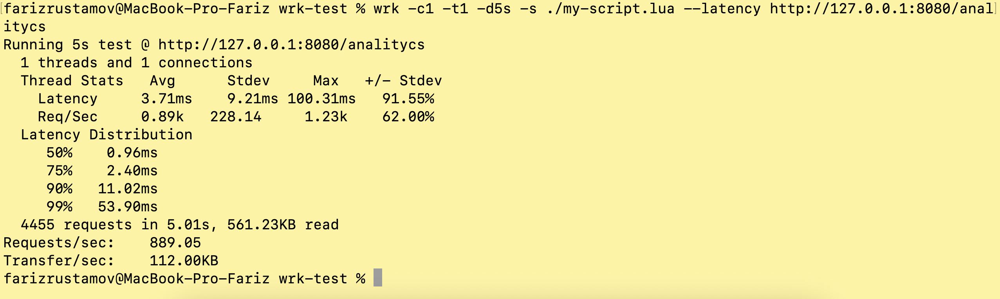
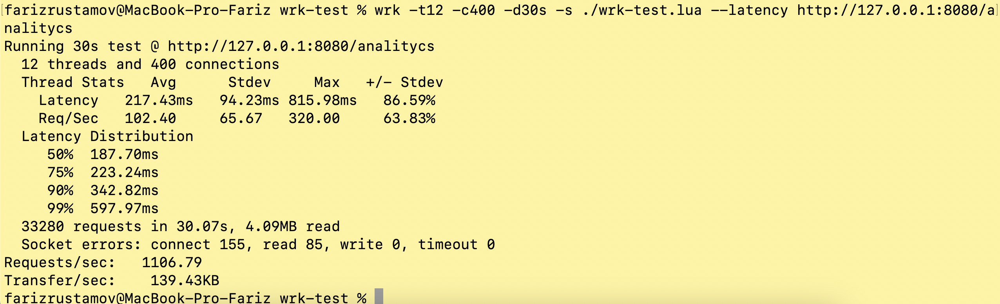

# analytics
## Postgres
$ make compose-up
## Run app with migrations
$ make run

## показатели rps
Тестирование проводилось с wrk и скриптом на lua.
Запуск у себя на локальном компьютере на macos с командой:
wrk -c1 -t1 -d5s -s ./wrk-test.lua --latency http://127.0.0.1:8080/analitycs

также запуск с другими параметрами с тем же скриптом и с тем же окружением c командой:
wrk -t12 -c400 -d30s -s ./wrk-test.lua --latency http://127.0.0.1:8080/analitycs

пример скрипта в папке stress-test/wrk-test.lua
